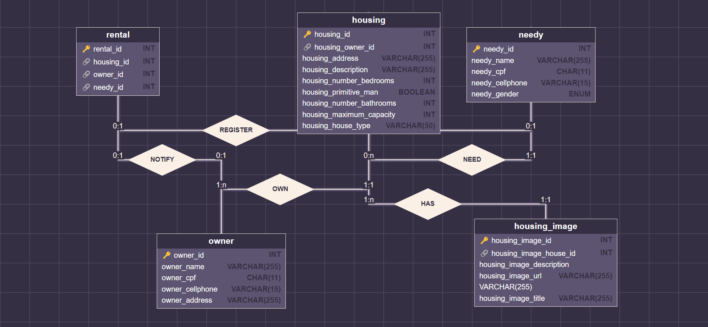
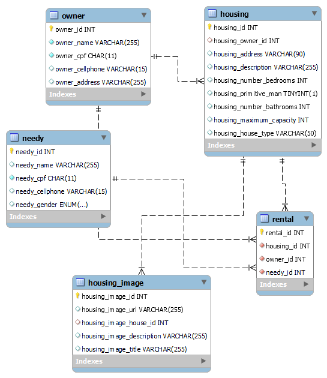

# Lar Solidário - Projeto Final M3
Repositório com os arquivos sql e imagens
## Como funciona?
O objetivo deste projeto é conectar pessoas em situação de vulnerabilidade com indivíduos que possuem algum tipo de moradia disponível e que estão dispostos a fornecer abrigo temporário. A ideia é oferecer a essas pessoas moradia temporária em um ambiente fácil de chegar e rápido. Para facilitar a busca e garantir uma melhor adequação entre as necessidades dos hóspedes e as disponibilidades dos anfitriões, os usuários poderão usar filtros como gênero e capacidade máxima na plataforma pra assim manter a segurança e praticidade;

## Diagrama ER

## Diagrama Conceitual

